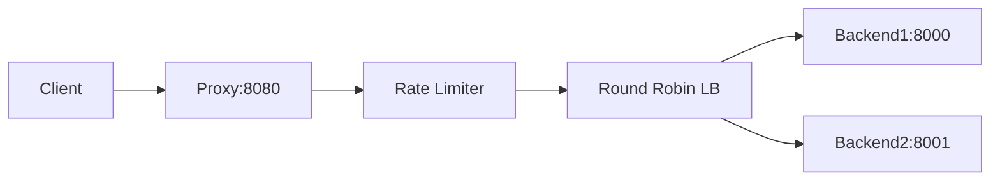

# Pace - Pingora Reverse Proxy

A high-performance HTTP reverse proxy built with Cloudflare's Pingora framework in Rust.

## Features

- **Round-Robin Load Balancing** - Distributes traffic evenly across backends
- **Per-IP Rate Limiting** - 100 req/60s per client (configurable)
- **Automatic Failover** - Retries on different backends when one fails
- **Prometheus Metrics** - Request latency histograms at `/metrics`
- **Header Injection** - Adds X-Proxy and X-Backend headers
- **Connection Pooling** - Reuses backend connections
- **Graceful Shutdown** - Handles in-flight requests on SIGTERM
- **TOML Configuration** - Easy configuration management

## Quick Start

```bash
# Build
cargo build --release

# Start all (proxy + test backends)
bash scripts/start_all.sh

# Test (in another terminal)
curl http://localhost:8080/test
curl http://localhost:8080/metrics
```

## Configuration

Edit `config/proxy.toml`:

```toml
[server]
listen = "0.0.0.0:8080"
workers = 4

[upstreams]
backends = ["http://127.0.0.1:8000", "http://127.0.0.1:8001"]

[rate_limit]
max_requests = 100
window_seconds = 60
key_extractor = "client_ip"

[metrics]
enabled = true
endpoint = "/metrics"
```

## Usage

### Development
```bash
RUST_LOG=info cargo run
```

### Production
```bash
RUST_LOG=info ./target/release/pace
```

### Testing

```bash
# Run automated tests
bash scripts/test_proxy.sh

# Test load balancing
for i in {1..6}; do
  curl -s http://localhost:8080/ | grep backend
done

# Test rate limiting (sends 105 requests)
for i in {1..105}; do
  curl -s -o /dev/null -w "%{http_code}\n" http://localhost:8080/
done

# View metrics
curl http://localhost:8080/metrics

# Load test with Apache Bench
ab -n 10000 -c 50 http://localhost:8080/
```

## Architecture



### Request Flow

1. **Request Filter** - Rate limit check, add X-Proxy header
2. **Upstream Selection** - Round-robin backend selection
3. **Failover** - Retry on connection failure (max 1 retry)
4. **Response Filter** - Add X-Backend header
5. **Metrics** - Record latency histogram
6. **Logging** - Log request details

## Production Deployment

### systemd Service

Create `/etc/systemd/system/pace.service`:

```ini
[Unit]
Description=Pingora Reverse Proxy
After=network.target

[Service]
Type=simple
User=pace
WorkingDirectory=/opt/pace
ExecStart=/opt/pace/pace
Environment="RUST_LOG=info"
Restart=on-failure
LimitNOFILE=65536

[Install]
WantedBy=multi-user.target
```

Enable and start:

```bash
sudo systemctl daemon-reload
sudo systemctl enable pace
sudo systemctl start pace
sudo systemctl status pace
```

### Prometheus Integration

Add to `prometheus.yml`:

```yaml
scrape_configs:
  - job_name: 'pace'
    scrape_interval: 15s
    static_configs:
      - targets: ['localhost:8080']
    metrics_path: '/metrics'
```

### nginx SSL Termination

```nginx
upstream pace_backend {
    server 127.0.0.1:8080;
    keepalive 32;
}

server {
    listen 443 ssl http2;
    server_name api.example.com;

    ssl_certificate /path/to/cert.pem;
    ssl_certificate_key /path/to/key.pem;

    location / {
        proxy_pass http://pace_backend;
        proxy_http_version 1.1;
        proxy_set_header Connection "";
        proxy_set_header Host $host;
        proxy_set_header X-Real-IP $remote_addr;
        proxy_set_header X-Forwarded-For $proxy_add_x_forwarded_for;
        proxy_set_header X-Forwarded-Proto $scheme;
    }

    location /metrics {
        proxy_pass http://pace_backend;
        allow 10.0.0.0/8;
        deny all;
    }
}
```

## Implementation Details

### Rate Limiter

Sliding window algorithm using `HashMap<String, Vec<u64>>`:
- Tracks request timestamps per IP
- Automatically expires old entries
- Thread-safe with `Arc<RwLock<>>`

### Load Balancer

Lock-free round-robin using `AtomicUsize`:
```rust
let index = self.round_robin_index.fetch_add(1, Ordering::Relaxed);
let backend_index = index % self.backends.len();
```

### Context (CTX)

Per-request state:
```rust
struct ProxyContext {
    backend_index: usize,
    failure_count: usize,
    selected_backend: Option<String>,
    start_time: Instant,
}
```

### Metrics

Prometheus histogram:
```
http_requests_duration_seconds_bucket{method="GET",status="200",le="0.01"} 23
http_requests_duration_seconds_sum{method="GET",status="200"} 0.523
http_requests_duration_seconds_count{method="GET",status="200"} 25
```

## Troubleshooting

### Port Already in Use
```bash
lsof -i :8080
kill -9 <PID>
```

### Backends Not Responding
```bash
ps aux | grep backend
curl http://127.0.0.1:8000
curl http://127.0.0.1:8001
```

### High CPU/Memory
```bash
# Monitor
top -u pace

# Profile
RUST_LOG=debug ./target/release/pace
```

### Rate Limit Stuck
Wait 60 seconds for window reset or restart proxy.

## Performance

Expected on modern hardware:
- **Throughput**: 10,000+ req/s per worker
- **Latency p50**: < 10ms
- **Latency p99**: < 50ms
- **Memory**: < 50MB under load

## Dependencies

- **pingora 0.6** - Core proxy framework (git main)
- **tokio 1.x** - Async runtime
- **prometheus 0.13** - Metrics
- **serde 1.x** - Configuration parsing
- **toml 0.8** - Config format
- **env_logger 0.11** - Logging

## Project Structure

```
pace/
├── config/proxy.toml       # Configuration
├── src/
│   ├── main.rs             # Proxy implementation
│   └── config.rs           # Config parser
├── scripts/
│   ├── start_all.sh        # Start all services
│   ├── test_proxy.sh       # Test suite
│   ├── backend1.py         # Test backend 1
│   └── backend2.py         # Test backend 2
└── target/release/pace     # Binary
```

## Contributing

1. Fork repository
2. Create feature branch
3. Add tests
4. Submit pull request

## License

See LICENSE file.

## Acknowledgments

Built with [Pingora](https://github.com/cloudflare/pingora) by Cloudflare.
